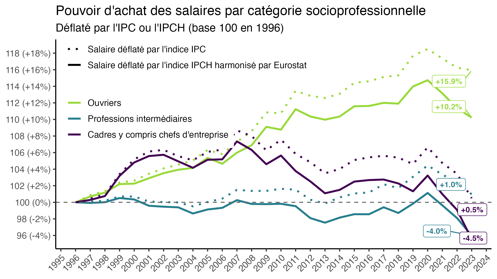
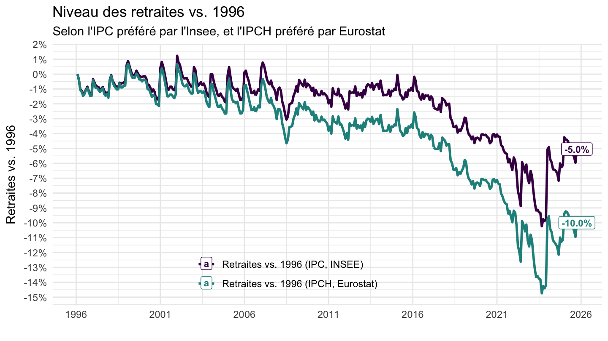
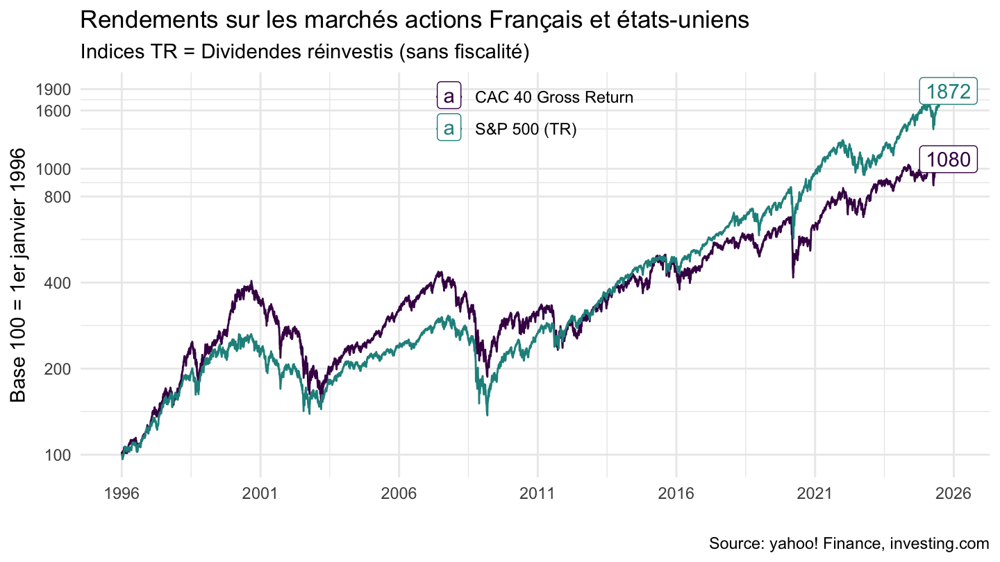
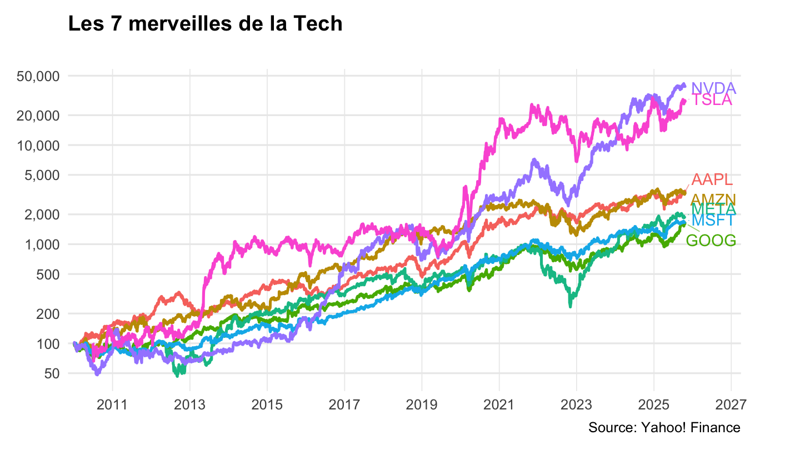

# Quelques questions sur la retraite par capitalisation

## Quel financement pour la transition ?

### Salaires depuis 1996

Double cotisation semble difficile dans un contexte de stagnation (voire diminution) salariale:

## Retraites depuis 1996

Mise à contribution très importante des retraités également difficile:

## Quels rendements pour la capitalisation ?

### CAC40 et S&P500

### Les 7 merveilles de la Tech

